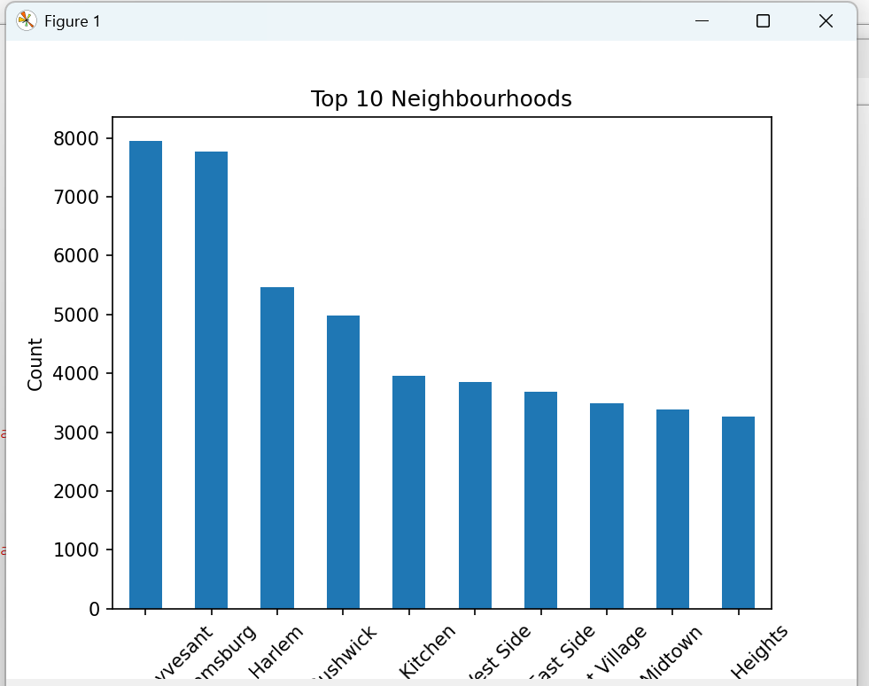
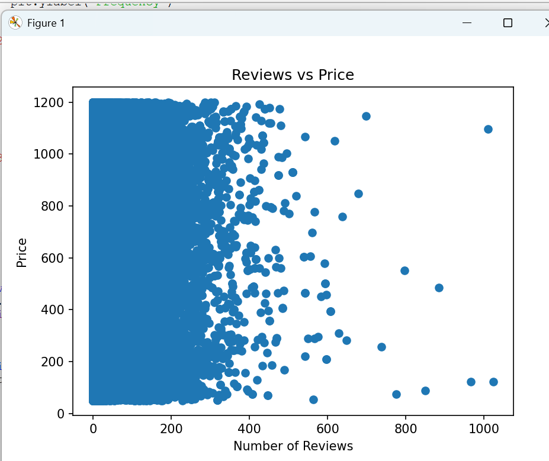

# Airbnb Data Analysis: Pricing & Occupancy Patterns

# Overview
Performed end-to-end data analysis on ~8K Airbnb listings to uncover pricing trends, demand patterns, and factors influencing occupancy.

## Objectives
- Clean and preprocess raw Airbnb data  
- Analyze pricing variations across neighbourhoods  
- Identify factors affecting listing popularity  
- Generate actionable insights  

## Tools
- Python (Pandas, NumPy)  
- Matplotlib, Seaborn  

## Major Insights
- Prices varied by 65–80% across neighbourhoods  
- Listings with 50+ reviews had ~2.5× higher engagement  
- Top 20% listings generated ~70% of total reviews  
- High-demand areas showed 30–40% higher occupancy trends  

## Visualizations
- ## Visualizations

### 1. Price Distribution
[price Distribution](price_distribution.png)

### 2. Top Neighbourhoods by Listings  

### 3. Reviews vs Price Analysis

